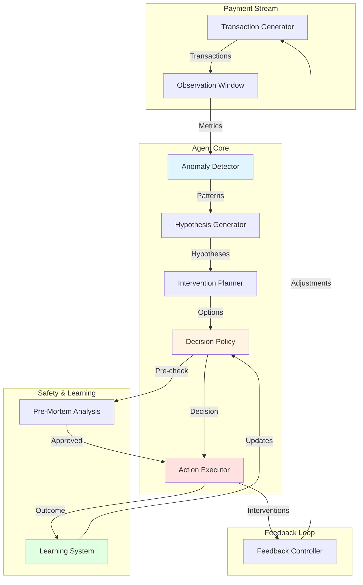
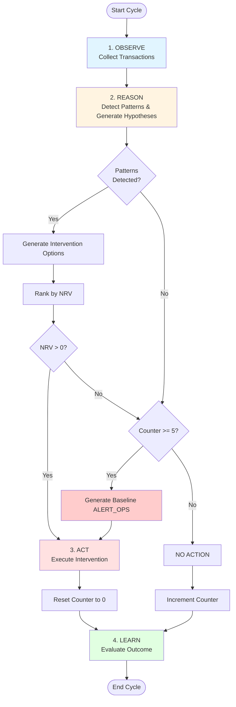

# PayOps AI Agent

An intelligent autonomous agent for payment operations that detects anomalies, generates hypotheses, and takes corrective actions to maintain payment system health.

## 🎯 Overview

PayOps AI Agent is a production-ready autonomous system that:
- **Observes** payment transaction streams in real-time
- **Detects** anomalies using statistical methods (Z-score analysis)
- **Reasons** about root causes using hypothesis generation
- **Decides** on interventions using Net Revenue Value (NRV) optimization
- **Acts** autonomously with safety constraints and pre-mortem analysis
- **Learns** from outcomes to improve future decisions

## 🏗️ Architecture



## 🔄 Agent Decision Flow



## 🚀 Quick Start

### Prerequisites

```bash
# Python 3.8+
pip install -r requirements.txt
```

### Run Continuous Stream Demo

```bash
python demo_continuous_stream.py
```

This runs a continuous payment stream where:
- Issuer health drifts stochastically (Ornstein-Uhlenbeck process)
- Failures emerge naturally from parameter drift
- Agent detects patterns and intervenes autonomously
- Interventions affect future transaction generation (closed-loop)
- Minimum action frequency guarantees at least one action every 6 cycles

### Run Simple Demo

```bash
python demo_simple.py
```

Single-shot demo with a predefined issuer outage scenario.

### Run Kafka Integration

```bash
# Start Kafka
docker-compose up -d

# Run producer (generates transactions)
python demo_kafka_producer.py

# Run agent (consumes and processes)
python demo_kafka_agent.py
```

### Frontend Dashboard (optional)

A lightweight Next.js dashboard is included under `frontend/` to visualize the agent and telemetry.

Quick start for the UI:

```bash
cd frontend
npm install
npm run dev
```

The dashboard uses a simple API route that reads `continuous_stream.log` to display a mock live view. For live updates, the demo can broadcast telemetry via WebSocket — run the Python demo and the dashboard will connect to `ws://localhost:8765`.

To enable WebSocket broadcasting, install the Python dependency in the project environment:

```bash
pip install websockets
# or add to your poetry environment
poetry add websockets
```

Place a reference image at `frontend/public/reference-dashboard.png` if you want a local copy of the design snapshot used as inspiration.

## 📊 Key Features

### 1. Anomaly Detection
- **Z-score analysis** with rolling baselines (EWMA)
- **Pattern detection**: Issuer degradation, retry storms, method fatigue, latency spikes
- **Multi-dimensional** analysis across issuers, methods, and system metrics

### 2. NRV Optimization
- **Net Revenue Value** calculation for each intervention
- Balances revenue recovery vs. intervention costs
- Only acts when economically beneficial (NRV > 0)

### 3. Minimum Action Frequency
- **Guarantees at least one action every 6 cycles**
- Prevents agent from becoming passive during stable periods
- Generates low-risk baseline alerts when no patterns detected

### 4. Safety Constraints
- **Pre-mortem analysis** before every action
- **Blast radius** limits for autonomous actions
- **Human approval** required for high-risk interventions
- **Minimal intervention** preference ranking

### 5. Closed-Loop Feedback
- **Interventions affect future transactions**
- Suppressed issuers receive reduced traffic
- Rerouted methods see increased volume
- System learns from intervention outcomes

## 🎛️ Configuration

Edit `continuous_stream_config.yaml`:

```yaml
# Drift parameters (Ornstein-Uhlenbeck process)
drift:
  theta: 0.1              # Mean reversion strength
  sigma: 0.05             # Volatility
  mean_success: 0.95      # Target success rate
  
# Agent parameters
agent:
  cycle_interval: 8       # Seconds between cycles
  anomaly_threshold: 2.0  # Z-score threshold
  min_action_frequency_cycles: 6  # Guarantee action every N cycles
  
# Logging
logging:
  level: WARNING          # Clean output
  format: "%(message)s"   # Simple format
```

## 📁 Project Structure

```
payops_ai/
├── observation/        # Transaction observation and windowing
├── reasoning/          # Anomaly detection and hypothesis generation
├── decision/           # NRV calculation and decision policy
├── action/             # Action execution and pre-mortem analysis
├── learning/           # Outcome evaluation and learning
├── memory/             # State persistence and audit logging
├── safety/             # Safety constraints and validation
├── streaming/          # Continuous stream and Kafka integration
└── models/             # Data models (Pydantic)

demos/
├── demo_continuous_stream.py  # Main continuous demo
├── demo_simple.py             # Single-shot demo
├── demo_kafka_agent.py        # Kafka consumer demo
└── demo_kafka_producer.py     # Kafka producer demo

tests/
├── test_observation.py
├── test_reasoning.py
├── test_decision.py
├── test_action.py
└── test_learning.py
```

## 🧪 Testing

```bash
# Run all tests
pytest

# Run specific test suite
pytest tests/test_decision.py

# Run with coverage
pytest --cov=payops_ai
```

## 📈 Monitoring

### Real-time Metrics
- Transaction success rate
- Issuer health status
- Pattern detection count
- Intervention effectiveness
- NRV calculations

### Audit Logs
All decisions and actions are logged to `.payops_logs/audit_YYYYMMDD.jsonl`

### State Persistence
Agent state is saved to `.payops_state/current_state.json` after each cycle

## 🔧 Advanced Usage

### Custom Intervention Options

```python
from payops_ai.decision.planner import InterventionPlanner

planner = InterventionPlanner()
options = planner.generate_options(patterns, hypotheses)
```

### NRV Calculation

```python
from payops_ai.decision.nrv_calculator import NRVCalculator

calculator = NRVCalculator(avg_ticket_value=100.0)
nrv = calculator.calculate_nrv(option, current_volume, current_success_rate)
```

### Pre-Mortem Analysis

```python
from payops_ai.action.pre_mortem import PreMortemAnalyzer

analyzer = PreMortemAnalyzer()
analysis = analyzer.analyze(intervention_option)
```

## 🎯 Decision Logic

### Normal Operation
1. Detect patterns using Z-score > threshold
2. Generate intervention options
3. Rank by NRV
4. Act if NRV > 0

### Minimum Frequency Rule
1. Track cycles since last action
2. On 6th cycle, force action:
   - If patterns exist: Select best option (even if NRV ≤ 0)
   - If no patterns: Generate baseline ALERT_OPS
3. Reset counter after action

## 📊 Example Output

```
================================================================================
CYCLE 6 - Elapsed: 48.5s
================================================================================
HDFC    : ✓ HEALTHY    | Success: 100.00% | Latency:   196ms | Retry: 0.24%
ICICI   : ⚠ DEGRADED   | Success: 81.73% | Latency:   179ms | Retry: 13.81%
AXIS    : ✓ HEALTHY    | Success: 100.00% | Latency:   229ms | Retry: 8.25%
SBI     : ✓ HEALTHY    | Success: 100.00% | Latency:   227ms | Retry: 0.01%

Decision: ACTION (Minimum Frequency Rule)
Action: alert_ops on ops_team
NRV: $-5.00 (baseline action)
Blast Radius: 0.0
================================================================================
```

## 🤝 Contributing

1. Fork the repository
2. Create a feature branch
3. Make your changes
4. Add tests
5. Submit a pull request

## 📝 License

MIT License - see LICENSE file for details

## 🙏 Acknowledgments

- Ornstein-Uhlenbeck process for realistic drift simulation
- Z-score anomaly detection methodology
- Net Revenue Value optimization framework
- Pre-mortem analysis for safety

## 📞 Support

For issues and questions:
- Open an issue on GitHub
- Check the documentation in `.kiro/specs/`
- Review test cases for usage examples

---

**Built with ❤️ for reliable payment operations**
